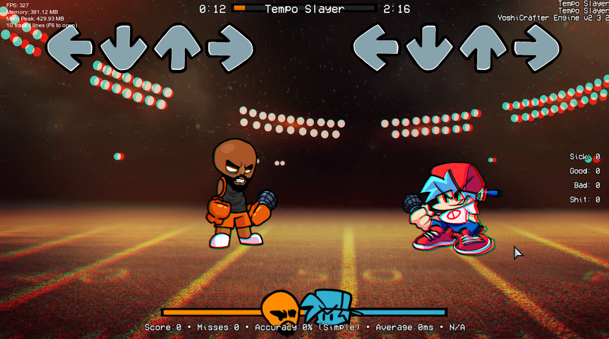

# Shadertoy To Flixel

A basic converter I made because I was too lazy to port shaders

# Limitations & Warnings

this conversion script does not remove paramaters from the main/mainImage function
you will need to remove those yourself
feel free to create a issue about anything not working cuz i made this in like 5 minutes lol